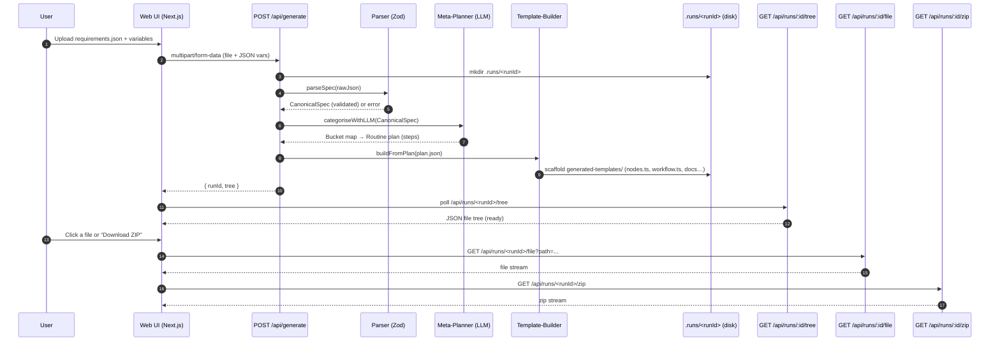

### Demo Flow — Meta-Template-Builder

tl;dr: upload → parse → plan → scaffold → download

## What happens at each step
1. User uploads a marketing requirements JSON (+ optional env vars).
2.	/api/generate creates a runId folder under .runs/, saving inputs.
3.	Parser (Zod) validates + normalizes to a CanonicalSpec.
4.	Meta-Planner (LLM) buckets needs and returns a Routine plan of steps.
5.	Template-Builder scaffolds a full Mastra-style template (nodes, workflow, critics, docs).
6.	API responds with { runId, tree }; the UI polls the tree endpoint.
7.	User downloads a single file or the whole ZIP.

## Notes
* Disk at .runs/<runId> is ephemeral on Vercel (perfect for demo runs).
* For DV360/Meta/AMC creds you can stub tool handlers; GA4 or pure compute steps work fine.
* Replace the minimal workflow.ts with Mastra’s typed workflow when you’re ready.