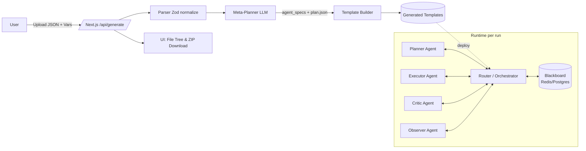
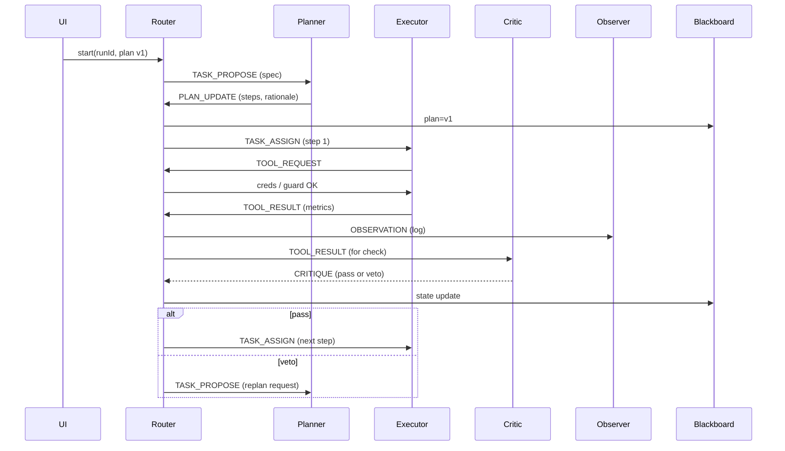

## Meta-Template Builder → Multi-Agent Enterprise Platform (Vision & Guide)

This doc outlines how our hackathon project grows into a serious, collaborative, enterprise-grade multi-agent system. It connects the current Mastra + Routine planning core to a message fabric, shared state, and (optionally) multi-agent RL.

---

### Why this matters (in one minute)
	•	Today: We already take structured product/marketing specs → plan with a large LLM (Routine-style JSON steps) → scaffold a runnable Mastra template + tools.
	•	Tomorrow: Give each sub-agent a mailbox and a small protocol for collaboration; add a blackboard (shared state), lightweight router, and critics as first-class participants.
	•	Result: Agents plan, execute, and negotiate. Observability is built-in. Guardrails bound spend and risk. Over time we can learn better policies (bandits, offline RL, MARL) from our run logs—safely.

----

### System at a Glance



----

#### Where we are now

	•	Parser: Validates/normalizes spec JSON with Zod.
	•	Meta-Planner: makeAgentSpecs() returns agent_specs (planner/executor/critic/observer) and we flatten planner steps into plan.json via flattenToRoutinePlan().
	•	Template Builder: Emits plan.json, agents.json, workflow.ts, nodes.ts, critics stub, README.
	•	UI: Upload spec & env vars → /api/generate → browse files → download ZIP.

----

## The next leap: Collaborative agents

#### Core ideas
* Agents are services with:
* role prompt + tool permissions
* a mailbox (topic/queue)
* access to shared state (“blackboard”)
* local memory (episodic + semantic)
* Messages are the contract. Every decision and tool call is an event you can audit, learn from, and replay.
* Blackboard holds the “world state” of a run: plan version, metrics, flags, artifacts.
* Protocols (simple, explicit):
* hierarchical supervisor–worker,
* blackboard publish/subscribe,
* critique/vote,
* (optional) bidding (contract-net).

#### Minimal message schema (TypeScript)

```ts

type MessageType =
  | "TASK_PROPOSE"   // propose a plan or change
  | "PLAN_UPDATE"    // new plan version from planner
  | "TASK_ASSIGN"    // assign a concrete step/tool call
  | "TOOL_REQUEST"   // request to execute a tool
  | "TOOL_RESULT"
  | "OBSERVATION"    // metrics, states, artifacts
  | "CRITIQUE"       // veto, policy violation, bounds exceeded
  | "DECISION"       // ACCEPT / REJECT / COMPLETE
  | "HEARTBEAT";

export type BusMessage<T = any> = {
  runId: string;
  stepId?: string;
  causationId?: string;
  correlationId?: string;
  sender: string;        // "search.planner" | "spend.critic" | "executor"
  type: MessageType;
  payload: T;
  confidence?: number;
  cost?: { tokens?: number; usd?: number };
  ts: string;
};
```
#### Shared state (blackboard)

* Redis hash / Postgres JSONB: current KPI snapshots, plan version, step outputs, flags (roasLow = true, deltaCpm = +18%), last decisions.
* Artifacts: S3/GCS paths for large outputs (CSVs, zips).
* Memory:
* episodic: recent messages per run (fast replay)
* semantic: vector store (pgvector/Weaviate) for retrieval-augmented agents
* structured: knowledge graph for entities (campaigns, deals, SKUs)

##### Router / Orchestrator

A tiny service that:
* validates messages (schema + policy),
* updates blackboard,
* records an audit log,
* forwards messages to interested agents,
* guardrails (budgets, rate limits, PII policy),
* decides next step (TASK_ASSIGN) or requests re-plan (PLAN_UPDATE).

Start simple with Redis Streams for the bus; evolve to NATS/Kafka as needed.

---

agents.json — enriched format

We already emit agents.json. Expand it slightly to encode collaboration:

```json
{
  "channel_id": "search_bid_guardian",
  "agents": [
    {
      "role": "planner",
      "name": "Search Planner",
      "mailbox": "runs.{runId}.plan",
      "subscriptions": ["OBSERVATION", "CRITIQUE"],
      "protocol": "hierarchical",
      "tools_allowed": ["ga4.pull", "compute.check", "gAds.updateBid"],
      "instructions": "Generate Routine plan; replan when CRITIQUE arrives."
    },
    {
      "role": "executor",
      "name": "Search Executor",
      "mailbox": "runs.{runId}.tool",
      "subscriptions": ["TASK_ASSIGN", "TOOL_REQUEST"],
      "protocol": "hierarchical"
    },
    {
      "role": "critic",
      "name": "Spend Guard",
      "mailbox": "runs.{runId}.critique",
      "subscriptions": ["TASK_PROPOSE", "TOOL_RESULT"],
      "guardrails": ["abs(deltaBidPct) <= 25"]
    },
    { "role": "observer", "name": "BQ Logger", "mailbox": "runs.{runId}.obs" }
  ]
}
```
---

#### Collaboration patterns that work
* Hierarchical (supervisor–worker)
Planner proposes → Router assigns → Executor runs tools → Observer logs → Critic can veto → Router asks planner to re-plan or continue.
* Blackboard
Agents publish facts; others react to state deltas. Great for KPI guards (“ROAS < 3”) and asynchronous signals.
* Critique/Vote
Multiple planners propose; critics score; Router chooses max-score plan (or weighted voting).
* Contract-Net (bidding)
For heterogeneous capabilities, agents bid with cost/ETA/confidence.

Pick one to start: hierarchical + blackboard covers most enterprise ops.

---

#### End-to-end run (example)



---

### Safety & enterprise guardrails
* Policy & secrets: OPA/Cedar for policy; Vault/GCP KMS for secrets; pass handles, not raw secrets, on the bus.
* PII: redact at the edge; scoped tokens; TTL; audit every access.
* Bounded actions: critics enforce constraints (Δbid ≤ 25%, brand-safety labels); Router rejects out-of-policy messages.
* Idempotency & recovery: causationId/correlationId; dedupe on bus; sagas for multi-step compensation.
* Observability: OpenTelemetry spans on every message/tool call; Langfuse for LLM traces & cost accounting.

---

### Learning from data (Multi-Agent RL & friends)

You’ll accumulate a goldmine of trajectory data: messages → decisions → outcomes. That unlocks:
* Bandits for thresholds: tune bid nudges / fatigue triggers online (safe exploration with budgets).
* Offline RL / OPE: learn better policies from logged data using Doubly-Robust / FQE; deploy under critic supervision.
* MARL (CTDE): Centralized Training, Decentralized Execution—train joint value functions offline; run agents independently with lightweight critics.
* Reward modeling: critics become learned reward estimators (violation risk, brand safety, CPA drift).
* Distillation: distill costly planner into a small model for repeatable tasks.

All of this is incremental—you can start with bandits/threshold search on a single guardrail, then expand.

---

### How to evolve this repo
1.	Keep current flow for generation
* /api/generate → parseSpec → makeAgentSpecs → flattenToRoutinePlan → builder emits plan.json + agents.json.
2.	Add a tiny runtime (experimental)
* packages/runtime/ service (Node/TS):
* Redis Streams bus (topics: runs.{runId}.*)
* Router with schema validation + guardrails
* Blackboard in Redis (or Postgres JSONB)
* Logger → Postgres (audit)
* Simple Executor that calls our tool wrappers
3.	Teach templates to publish events
* In workflow.ts, after each tool call → publish TOOL_RESULT and OBSERVATION.
* Add an optional Critic subscriber (spend guard, brand safety).
4.	Publish a demo
* One agent set (Search Bid Guardian) fully wired:
* planner, executor, critic, observer
* a small dashboard (Langfuse + a table of messages)
5.	Gradually add research
* Start with threshold tuning (bandit) for one KPI.
* Design message → reward mapping (safe, bounded).
* Enable offline evaluation on the audit log.
---

### Minimal Router pseudo-code

```ts
for await (const msg of bus.consume(`runs.${runId}.#`)) {
  validateSchema(msg);
  enforcePolicy(msg);
  audit.write(msg);
  blackboard.apply(msg);

  switch (msg.type) {
    case "PLAN_UPDATE":
      assignFirstStep(msg.runId);
      break;
    case "TOOL_RESULT":
      publish("OBSERVATION", summarize(msg));
      fanoutToCritics(msg);
      break;
    case "CRITIQUE":
      if (msg.payload.veto) requestReplan();
      else assignNextStep();
      break;
    // …
  }
}
```
---

### FAQ

Q: Why not let agents talk directly to each other?
A: You can, but a router makes audit, guardrails, and cost controls trivial. It’s the difference between a chat and a Ledger.

Q: What’s the first critic to add?
A: A spend/bid bound (|Δbid| ≤ 25%) and a brand-safety veto. Both are cheap and high-impact.

Q: Can this run on Vercel?
A: The generator app yes (stateless). The runtime wants Redis/Postgres/S3 and should run as a small service (Fly.io, Railway, AWS Fargate etc.).

---

#### Glossary
* Routine plan: ordered steps {id, tool, inputs, outputs, condition?} with typed pipes.
* Planner / Executor / Critic / Observer: major agent roles.
* Blackboard: shared run state all agents can read/write.
* Bus: messaging fabric (Redis/NATS/Kafka).
* OPE: Off-Policy Evaluation (estimate new policy value from old logs).
* CTDE: Centralized Training, Decentralized Execution (MARL).

---

This repo already proves the structured planning + codegen loop. By adding mailboxes, a router, and a blackboard, we get collaborative agents you can audit, throttle, and continuously improve. The fun part? Our logs become a training set—so all the classic ideas from multi-agent RL finally have a practical, scalable home.
